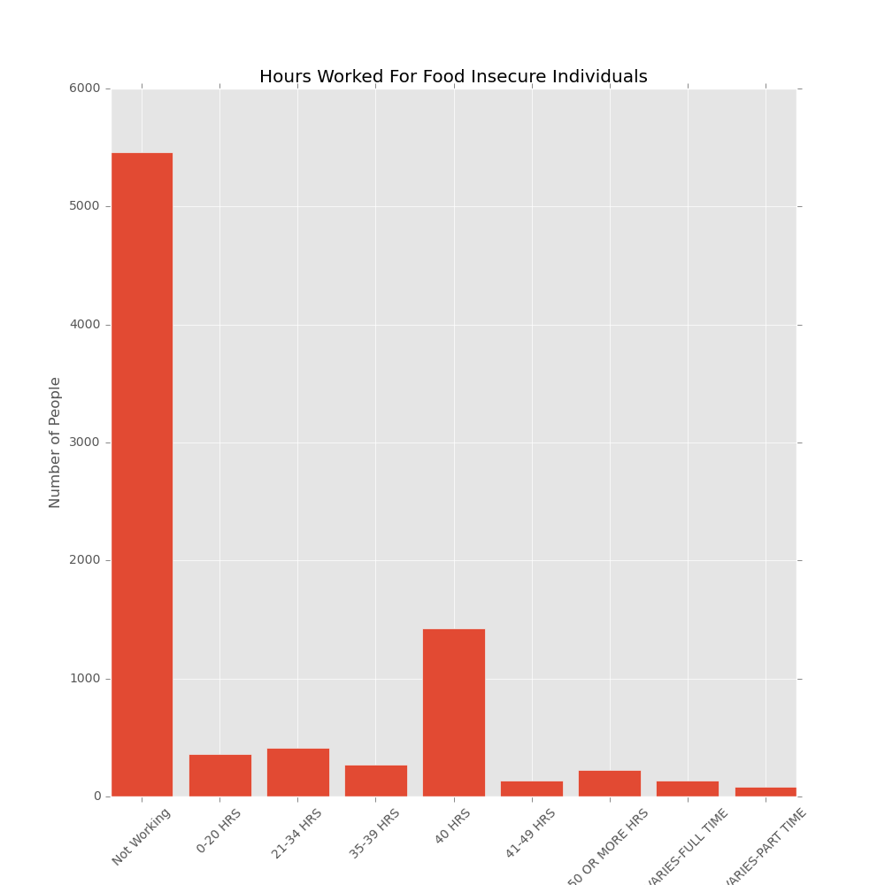
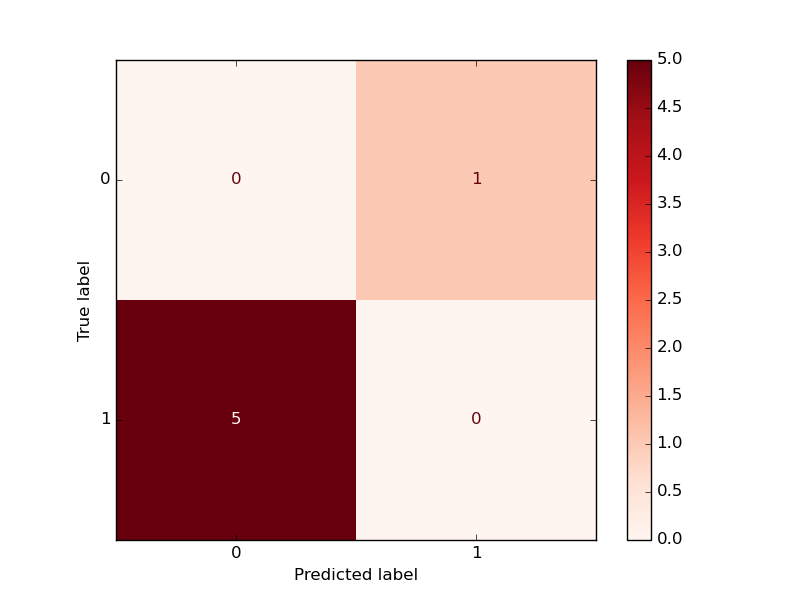
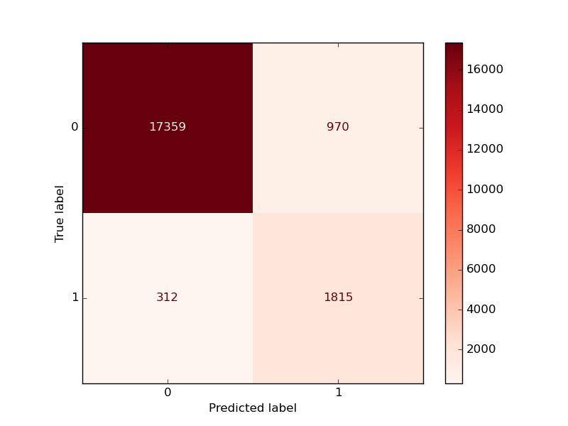

# Food Insecurity in the US

## Predicting Food Insecurity for Participants of the Current Population Survey

### Summary
One of the hardest things to do in life is to ask for help. Too many families in the United States are struggling with food insecurity. This Current Population Survey asked US households numerous questions that may or may not be related to food insecurity, as well as directly if they were facing insecurity. I will use a model to predict insecurity based on responses to the other questions. If I can make a model that is accurate, I may be able to expand the model to predict which households are in-fact struggling with insecurity but are not able to or are unwilling to admit that they do need some help. With these results, we could try to reach out to these struggling families in a different way to ensure they still receive the help that they need.

### Contents
1. Reading in and Cleaning Data
2. Exploratory Data Analysis 
3. Model and Error Metric Selection
4. Model Training
5. Results and Conclusion
6. Sources

### 1. Reading in and Cleaning Data
The data is in CSV Format, with 138964 Entries and 510 Features. Each entry is a survey that was completed by an individual in the US. Aside from 1 column that was used as a filler of NaN values, all other columns were of type integer with no missing values. Each column is labeled as an alphanumeric code that consists of integers that represent a class or statement. Here is a look at a the column format, which will be used as our target, as well as what it means.

HRFS12M1  
Summary Food Security Status, 12-Month Recall (Recode of HRFS12M4)  

VALID ENTRIES:  
1 Food Secure High or Marginal Food Security  
2 Low Food Security  
3 Very Low Food Security 
-1 Not in Universe (Didn't participate in survey)
-9 No Response 
 
Food Security has been determined by a Rasch Model.  
From Wikipedia:  
The Rasch model, named after Georg Rasch, is a psychometric model for analyzing categorical data, such as answers to questions on a reading assessment or questionnaire responses, as a function of the trade-off between (a) the respondent's abilities, attitudes, or personality traits and (b) the item difficulty.

Aside from the filler column, I identified 3 categories of columns that would need to be dropped. The first were columns that did not add any infomation for machine learning. An example of this was the year column, in which there was only one unique value of 2019 (since this was the year that the survey took place). The next were a series of weight columns. These weights were calculated after-the-fact to determine how much this individual represented the state or national population. Finally, a number of columns would be a source of data-leakage. A number of these columns held similar information as our target column, and many of these were confimred to have a near 100% correlation with our target. After testing the initial model, the model scores showed that there was still data leakage present. After identifying the leaky columns, I returned to the cleaning pipeline and removed them.

### 2. Exploratory Data Analysis 
During my EDA, one of the features I wanted to take a look at was the hours worked for those that were determined to be food insecure. Using matplotlib and some feature engineering, I created a bar graph of the hours worked.   

  

This surprised me. There is an unfortunate assumption of people that are struggling, that they are lazy and need to work harder. I know that this is not true, but I was caught off guard with how many individuals worked full-time, or more, and were still deemed food insecure. To compare with individual that are NOT food insecure, here is the same graph below. Note that the y scale is different because of the data imbalance.

 

People that are in need of help come in all shapes, sizes, and situations. Trying to build a model to attempt to capture a common trend will not be an easy task.

### 3. Model and Error Metric Selection
Before creating my first model, the first step is to decide how to judge if the model is doing a good job. I chose to use recall as I want to minimize False Negatives or, alternatively, find all of the positive samples (in this case, positive is a food insecure individual). Since the model could obtain a high recall score at the expense of other metrics (such as precision), I created a cost matrix that heavily penalized False Negatives, but also penalized False Positives. I can multiply the calculated confusion matrix by the cost matrix and find the sum to determine a model's "cost". Minimizing the cost should give us our ideal model.  
  
The next step was One Hot Encoding. Every column in the dataset was a representation of yes/no/no type of response or an integer representing a job code, for instance. Each of these would need to be encoded, and I used Pandas get_dummies to get the job done.  
For initial testing, I tried to use 3 different models to see which would have the best baseline to then tune its hyperparameters. The 3 models were MLP Classifier, Random Forest Classifier, and Gradient Boosting Classifier. During the first test, it became apparent that there was still data-leakage, so I had to return to the data pipeline to remove those. After that was completed, I decided to use the Random Forest to create a model testing pipeline. 

Initial Model Testing  
Random Forest Recall: 0.667, Cost: 2156.0
The cost is arbitrary and will only be useful as a comparison.

### 4. Model Training
For model training, I used the training and validation set of data that was pulled from the cleaned dataset (the train-test-split was stratified as the data is imbalanced). In addition to the Random Forest, I also trained a Multi-Layer Perceptron as well as a Gradient Boosted Classifier. The results are as follows:  
Multi-Layer Perceptron recall: 0.7969173781324035, cost: 1493.2  
GradientBoostingClassifier() recall: 0.7100260453280495, cost: 1990.6  
Though both of these models were an improvement from the Random Forest, they also took significantly longer to train. To use a Grid Search to tune their hyperparameters would be prohibitively expensive with regards to time, so I decided to try to use a Grid Search with the Random Forest. Unfortunately, even though the Random Forest was quicker than the others, it was not fast enough. Due to time constraints, I decided to go with the best model I had, which was the MLP. The parameter I was able to tune was the threshold with predict_proba. Once this was complete, my model was ready for the final test.

### 5. Results and Conclusion
The MLP performed much better than I thought that it would:  
  
The final recall score using the test set was 0.853, with an overall cost that was consistent with the training data. The goal moving forward would be to tune the hyperparameters for the MLP. As the model improves, I could reduce the number of survey questions that the model recieves, with the ultimate goal of eliminating the Supplemental Food Security Survey. Surveys can be a great tool, but must always be taken with a grain of salt. If I could build an accurate model using more generic census data, the model might be able to predict the national level of food insecurity. This is likely not an obtainable goal for the near future.

### 6. Sources
Data Source(s):
US Census Bureau
https://www.census.gov/data/datasets/2019/demo/cps/cps-food-security.html

Other Source(s):
Food Security Technical Documentation
https://www2.census.gov/programs-surveys/cps/techdocs/cpsdec19.pdf
Wikipedia - Rasch Model
https://en.wikipedia.org/wiki/Rasch_model
